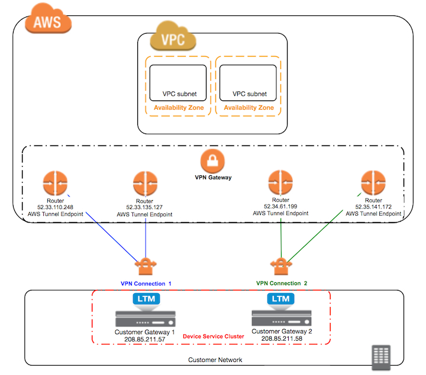

# bigip_aws_vpn
## Example of using BIG-IP with AWS's IPSEC VPN 

This solution demonstrates automating BIG-IPs (physical or virtual) to connect to AWS's built-in IPSEC VPN offering. It leverages Ansible and contains playbooks to:

* Create/Delete an example VPC with Ubunutu test host
* Create/Delete AWS VPN elements, including customer gateways, vpn gateways and vpn connections.
* Configure On-Prem BIG-IPs to act as the customer gateways

It also serves as a reference implementation.



###  *Requirements* 

#### F5 BIG-IPs:
* Two F5 BIG-IPs running Local Traffic Manager (LTM)
  * The two BIG-IPs referred to in this repo are your "on-prem customer gateways")
  * Per AWS documentation, the addresses used for the customer gateways (BIG-IP Self IPs) can not sit behind a NAT (which precludes testing with BIG-IP VEs in AWS).
* Software version == BIG-IP v12.0.0+
  * Versions Tested so far: 
  	* BIG-IP v12.0.0 Build 0.0.606
* In order to run above playbooks
  * Have your public ssh key installed in BIG-IP's /root/.ssh/authorized_keys
  * BIG-IPs are ideally minimally configured with only a Management IP

#### AWS:
* Account w/ credentials to create associated resources (VPC, VPN elements, etc)

#### Automation Host:
* git
* python 2.7.x
  * ansible
  * boto
  * bigsuds
  * see "requirements.txt" for additional modules
* AWS Access and Secret Keys configured in boto's typical location ~/.aws/credentials:
* connectivity to both AWS API and BIG-IP Mgmt IPs
* tested on MacOS and ubuntu


### Manual (TMSH) Deployment Overview

The commands below assuming you're in tmsh. If starting in bash, enter tmsh by typing "tmsh"
ex.
```
[root@localhost:NO LICENSE:Standalone] config # tmsh 
root@(localhost)(cfg-sync Standalone)(NO LICENSE)(/Common)(tmos)#
```
If automating, you can also run from bash by prepending "tmsh" to the commands
ex.
```
[root@localhost:NO LICENSE:Standalone] config # tmsh modify sys global-settings hostname "bigip-vpn-01.mgmt.example.com"
```

Although some of the config objects will be unique to a BIG-IP or AWS Connection, they will actually be shared in the cluster.

For complete example configs of a clustered pair, see the example-configs directory.

* Full Single Config File (SCF) backups of devices used for testing (to show items that have been shared )
	* bigip-01.scf
	* bigip-02.scf
* Partical SCF with VPN specific config objects for each device
	* bigip-01-vpn-specific-config
	* bigip-02-vpn-specific-config
* ZebOS.conf files
	* bigip-01-ZebOS.conf
	* bigip-02-ZebOS.conf
* TMSH commands to create the config (these will be easier to view / edit )
    * bigip-01-tmsh
    * bigip-02-tmsh

#### STEPS:

1. Install BIG-IPs into your environment
	* *For full instructions, see the appropriate installation guides on https://support.f5.com*
	* *SUMMARY:*
  	* Download/Install F5 BIG-IPs: 
  		* If you don't have an account, register for a support account @ 
  		https://login.f5.com/resource/login.jsp
  		* Go to "Downloads" on left hand menu
  			* Find a Download
  				* BIG-IP (ex. BIG-IP v12.x / Virtual Edition )
			  		* Select Virtual Edition (select image)

2. Change Passwords

	On each device:
	```
	modify auth password root <it will prompt you> 

	modify auth user admin password <your password>
	```

3. License

	On each device (customize the "hostname" per device):
	```
	modify sys global-settings hostname "bigip-vpn-01.mgmt.example.com"

	modify sys dns name-servers add { 10.11.26.1 }

	modify sys ntp servers add { "0.pool.ntp.org" }

	install sys license registration-key "XXXXXXXXXXXXXXXX"
	```

4. Configure Global Settings

	On each device:
	```
	modify sys global-settings gui-setup disabled
	# To keep clustering stable on BIG-IP VEs
	modify sys db dhclient.mgmt { value "disable" }
	```

5. Configure Network: 

	On each device:

	Vlans:
	```
	create net vlan internal interfaces add { 1.1 }

	create net vlan external interfaces add { 1.2 }
	```

	Unique Self-IPs (customize per device):
	```
	create net self 208.85.211.57 address 208.85.211.57/28 traffic-group traffic-group-local-only vlan external

	create net self 10.12.0.57 address 10.12.0.57/16 allow-service default traffic-group traffic-group-local-only vlan external

	create net self 10.3.0.2 address 10.3.0.2/16 allow-service default traffic-group traffic-group-local-only vlan internal
	```

	On bigip-01: (will sync when clustered)

	Floating Self-IPs:
	```
	create net self 10.12.0.56 address 10.12.0.56/16 traffic-group traffic-group-1 vlan external

	create net self 10.3.0.1 address 10.3.0.1/16 allow-service default traffic-group traffic-group-1 vlan internal
	```

	Forwarding Virtual Server:
	```
	create ltm profile fastL4 fastL4-test loose-close enabled loose-initialization enabled reset-on-timeout disabled

	create ltm virtual vs_outbound destination 0.0.0.0:any ip-forward profiles add { fastL4-route-friendly }
	```

6. Cluster Devices

	On bigip-01:
	```
	delete cm trust-domain all

	mv cm device bigip1 bigip-vpn-01.mgmt.example.com

	modify cm device bigip-vpn-01.mgmt.example.com configsync-ip 10.12.0.57 unicast-address { { effective-ip 10.12.0.57 effective-port 1026 ip 10.12.0.57 } } mirror-ip 10.12.0.57 mirror-secondary-ip 10.12.0.57
	```
	On bigip-02:
	```
	delete cm trust-domain all

	mv cm device bigip1 bigip-vpn-02.mgmt.example.com

	modify cm device bigip-vpn-02.mgmt.example.com configsync-ip 10.12.0.58 unicast-address { { effective-ip 10.12.0.58 effective-port 1026 ip 10.12.0.58 } } mirror-ip 10.12.0.58 mirror-secondary-ip 10.12.0.58
	```

	__*NOTE: Make sure bigip-02 peer has all steps above completed before proceeding*__

	Only from bigip-01 (cluster primary/seed):
	```
	modify cm trust-domain Root ca-devices add { 10.11.50.22 } name bigip-vpn-02.mgmt.example.com username admin password "<password>"

	create cm device-group my_sync_failover_group type sync-failover devices add { bigip-vpn-01.mgmt.example.com bigip-vpn-02.mgmt.example.com } auto-sync enabled
	```

	Configure Additional Traffic Groups only on bigip-01 (cluster/primary seed):
	*As tunnels will only be live on an "Active" device, we configure additional traffic groups to live on each device. We will place the virtual servers, including the forwarding virtual server in traffic-group-1 so it can failover across the devices.* 

	```
	create cm traffic-group traffic-group-2 auto-failback-enabled true ha-order { bigip-vpn-01.mgmt.example.com bigip-vpn-02.mgmt.example.com }

	create cm traffic-group traffic-group-3 auto-failback-enabled true ha-order { bigip-vpn-02.mgmt.example.com bigip-vpn-01.mgmt.example.com } 
	```

	Once Clustering is completed and an status is "In-Sync", proceed to step 7.

7. Configure IPSEC Global Settings

	On each device:
	```
	# To allow link local addresses on tunnels 
	modify sys db config.allow.rfc3927 { value "enable" } 
    # To allow dynamic routing over the ipsec tunnels
	modify sys db ipsec.if.checkpolicy { value "disable" }
	# Optional to allow for asymetric traffic returning from different tunnels
    # Otherwise, to keep traffic symmetric, will need to disable ECMP and use as-path prepend in ZebOS.conf
	modify sys db connection.vlankeyed { value "disable" } 
	```

8. Configure IKE Peers

	On bigip-01: (will sync when clustered) 
	```
	create net ipsec ike-peer aws_vpn_conn_1_peer_1 lifetime 480 my-id-type address peers-id-type address phase1-auth-method pre-shared-key phase1-encrypt-algorithm aes128 remote-address 52.24.244.82 verify-cert true version add { v1 } preshared-key <key>

	create net ipsec ike-peer aws_vpn_conn_1_peer_2 lifetime 480 my-id-type address peers-id-type address phase1-auth-method pre-shared-key phase1-encrypt-algorithm aes128 remote-address 52.25.19.43 verify-cert true version add { v1 } preshared-key <key> 

	create net ipsec ike-peer aws_vpn_conn_2_peer_1 lifetime 480 my-id-type address peers-id-type address phase1-auth-method pre-shared-key phase1-encrypt-algorithm aes128 remote-address 52.25.240.97 verify-cert true version add { v1 } preshared-key <key>

	create net ipsec ike-peer aws_vpn_conn_2_peer_2 lifetime 480 my-id-type address peers-id-type address phase1-auth-method pre-shared-key phase1-encrypt-algorithm aes128 remote-address 54.200.79.6 verify-cert true version add { v1 } preshared-key <key>

	```

9. Configure IPSEC Policy

	On bigip-01: (will sync when clustered) 
	```
	create net ipsec ipsec-policy AWS_IPSEC_Interface_Policy ike-phase2-auth-algorithm sha1 ike-phase2-encrypt-algorithm aes128 ike-phase2-lifetime 60 ike-phase2-perfect-forward-secrecy modp1024 mode interface
	```

10. Configure IPSEC Selectors

	On bigip-01: (will sync when clustered) 
	```
	create net ipsec traffic-selector aws_conn_1_tun_1_selector destination-address 169.254.12.44/30 ipsec-policy AWS_IPSEC_Interface_Policy source-address 169.254.12.44/30

	create net ipsec traffic-selector aws_conn_1_tun_2_selector destination-address 169.254.12.28/30 ipsec-policy AWS_IPSEC_Interface_Policy source-address 169.254.12.28/30

	create net ipsec traffic-selector aws_conn_2_tun_1_selector { destination-address 169.254.12.160/30 ipsec-policy AWS_IPSEC_Interface_Policy source-address 169.254.12.160/30 }

	create net ipsec traffic-selector aws_conn_2_tun_2_selector { destination-address 169.254.12.76/30 ipsec-policy AWS_IPSEC_Interface_Policy source-address 169.254.12.76/30 }
	```

11. Configure IPSEC Profiles

	On bigip-01: (will sync when clustered)  
	```
	create net tunnels ipsec aws_conn_1_tun_1_profile app-service none defaults-from ipsec traffic-selector aws_conn_1_tun_1_selector 

	create net tunnels ipsec aws_conn_1_tun_2_profile app-service none defaults-from ipsec traffic-selector aws_conn_1_tun_2_selector 

	create net tunnels ipsec aws_conn_2_tun_1_profile app-service none defaults-from ipsec traffic-selector aws_conn_2_tun_1_selector 

	create net tunnels ipsec aws_conn_2_tun_2_profile app-service none defaults-from ipsec traffic-selector aws_conn_2_tun_2_selector 
	```

12. Configure Tunnel Keep Alive Pools

	On bigip-01: (will sync when clustered) 
	*This pool is to help drive traffic through the tunnels to help keep them up and optionally used in HA groups to help determine number of tunnels up and dictate failover* 
	```
	create ltm pool aws_conn_1_keep_alive_pool members add { 169.254.12.29:179 { address 169.254.12.29 } 169.254.12.45:179 { address 169.254.12.45 } } monitor tcp_half_open and gateway_icmp

	create ltm pool aws_conn_2_keep_alive_pool members add { 169.254.12.161:179 { address 169.254.12.161 } 169.254.12.77:179 { address 169.254.12.77 } } monitor tcp_half_open and gateway_icmp 
	```

13. Configure Tunnels (customize per each device as will NOT sync). ex. 

	On bigip-01:
	```
	create net tunnels tunnel aws_conn_1_tun_1 local-address 208.85.211.57 mtu 1436 profile aws_conn_1_tun_1_profile remote-address 52.24.244.82

	create net tunnels tunnel aws_conn_1_tun_2 local-address 208.85.211.57 mtu 1436 profile aws_conn_1_tun_2_profile remote-address 52.25.19.43
	```
	On bigip-02:
	```
	create net tunnels tunnel aws_conn_2_tun_1 local-address 208.85.211.58 mtu 1436 profile aws_conn_2_tun_1_profile remote-address 52.25.240.97

	create net tunnels tunnel aws_conn_2_tun_2 local-address 208.85.211.58 mtu 1436 profile aws_conn_2_tun_2_profile remote-address 54.200.79.6
	```

14. Configure Tunnel Self-IPs (customize per each device as will NOT sync). ex.

	On bigip-01:
	```
	create net self 169.254.12.30 address 169.254.12.30/30 allow-service all traffic-group traffic-group-local-only vlan aws_conn_1_tun_2 

	create net self 169.254.12.46 address 169.254.12.46/30 allow-service all traffic-group traffic-group-local-only vlan aws_conn_1_tun_1 
	```
	On bigip-02:
	```
	create net self 169.254.12.78 address 169.254.12.78/30 allow-service all traffic-group /Common/traffic-group-local-only vlan aws_conn_2_tun_2

	create net self 169.254.12.162 address 169.254.12.162/30 allow-service all traffic-group /Common/traffic-group-local-only vlan aws_conn_2_tun_1 
	```

15. Configure BGP (customize per each device as will NOT sync). ex. 

	On each device: 

	Copy or create the file /config/zebos/rd0/ZebOS.conf similar to example_configs/cache/bigip-01_ZebOS.conf or bigip-02-ZebOS.conf 
	(customizing neighbor addresses to match appropriate tunnel inside adddresses):
	```
	!
	no service password-encryption
	!
	log file /var/log/zebos
	!
	!debug bgp
	!debug bgp nsm
	!debug bgp nht
	!debug bgp events
	!debug bgp keepalives
	!debug bgp updates
	!debug bgp fsm
	!debug bgp filters
	!debug bgp dampening
	!debug bgp bfd
	!
	router bgp 65000
	 bgp router-id 169.254.12.46
	 max-paths ebgp 8
	 bgp log-neighbor-changes
	 bgp graceful-restart restart-time 120
	 network 10.3.0.0/16
	 neighbor 169.254.12.45 remote-as 7224
	 neighbor 169.254.12.45 default-originate
	 neighbor 169.254.12.45 soft-reconfiguration inbound
	 neighbor 169.254.12.45 capability graceful-restart
	 ! neighbor 169.254.12.45 route-map prepend-tunnel-1 out
	 neighbor 169.254.12.29 remote-as 7224
	 neighbor 169.254.12.29 default-originate
	 neighbor 169.254.12.29 soft-reconfiguration inbound
	 neighbor 169.254.12.29 capability graceful-restart
	 ! neighbor 169.254.12.29 route-map prepend-tunnel-2 out
	 !
	route-map prepend-tunnel-1 permit 10
	 set as-path prepend 65000
	!
	route-map prepend-tunnel-2 permit 10
	 set as-path prepend 65000 65000
    ! 
	! Peer config would have have below route maps instead:
	! route-map prepend-tunnel-1 permit 10
 	! set as-path prepend 65000 65000 65000
    !
    ! route-map prepend-tunnel-2 permit 10
    ! set as-path prepend 65000 65000 65000 65000
    !
	line con 0
	 login
	line vty 0 39
	 login
	!
	end
	```

	Enable BGP:

	On each device:
	```
	modify net route-domain 0 routing-protocol add { BGP }
	```
 
	Optionally, you can enable BGP and then configure from imish (the ZebOS shell).

	For more information: See https://support.f5.com/kb/en-us/products/big-ip_ltm/manuals/product/tmos-routing-administration-12-0-0/11.html#unique_1718224504 


17. *RECOMMENDED* if you want to failover based on tunnel health/the number of tunnels available, you can create an HA group. 
	ha-groups are not shared and need to be configured separately on each device. ex.

	On bigip-01:
	```
	create sys ha-group vpn_conn_1_up pools add { aws_conn_1_keep_alive_pool { threshold 1 weight 10 } } 
	```

	On bigip-02:
	```
	create sys ha-group vpn_conn_2_up pools add { aws_conn_2_keep_alive_pool { threshold 1 weight 10 } } 

	```

	Configure to the ha-group work on traffic-group-1
	On bigip-01:
	```
	cm traffic-group /Common/traffic-group-1 { ha-group vpn_conn_1_up }
	```
	On bigip-02:
	```
	cm traffic-group /Common/traffic-group-1 { ha-group vpn_conn_2_up }
	```


### *Automated Instructions*

1. Install BIG-IPs into your environment (same as Manual Deployment above)
		
	* Install SSH Key:
  		* Default login credentials: CLI = root/default, GUI = admin/admin
  		* BIG-IP VEs will automatically pick up a DHCP address on their mgmt port (eth0)
  		* Otherwise, go to the Console (serial or emulator provided by your hypervisor and login as root/default) and type in "config" to set the mgmt ip
  		* Install your public SSH key into ~/root/.ssh/authorized_keys

2. On your automation host:
  	* git clone https://github.com/smooth-alg/bigip-aws-vpn.git
  	* Install software (cd bigip-aws-vpn; pip install -r requirements.txt)
  	* edit "~/.aws/credentials" to provide credentials for boto.

  		ex. $cat ~/.aws/credentials
		``` bash
		[default]
		aws_access_key_id = XXXXXXXXXXXA
		aws_secret_access_key = XXXXXXXXXXXXXXXXXXXXX
		```

  	* create "~/creds.yml"  - a custom credential file for this repo in your home directory. 

  		ex. $cat ~/creds.yml
		``` yaml
		---
		region: "us-west-2"
		private_key_file=~/.ssh/<your-key-name>.pem

		# NOTE:
		# Pre v11.6, CLI uses root
		# v11.6 and later, AWS AMIs use admin

		# Warning: when configuring passwords via bigip_base which uses tmsh commands directly from bash you can't have a "#" in the password as tmsh will think it's a comment
		ansible_ssh_user: "root"
		ansible_ssh_pass: "MyPassword"

		bigip_rest_user: "rest-admin"
		bigip_rest_password: "myPassword"
		```
	* edit variables in inventory/host_vars/bigip-01 and bigip-02:
		* See comments at top of those files for minimum/required variables to customize


3. Run playbooks from within bigip-aws-vpn directory. Set the env_tag for name of your deployment.

  	* Create/Delete an example VPC with client ami for testing
	```
	ansible-playbook playbooks/create-vpc.yml --extra-vars '{"env_tag":"example_vpn"}'

	ansible-playbook playbooks/delete-vpc.yml --extra-vars '{"env_tag":"example_vpn"}'
	```

  	* Create/Delete 2 Customer Gateways, one VPN Gateway and 2 VPN Connections
	```
	ansible-playbook playbooks/create-vpn.yml --extra-vars '{"env_tag":"example_vpn"}'

	ansible-playbook playbooks/delete-vpn.yml --extra-vars '{"env_tag":"example_vpn"}'
	```

  	* Configures/Reset on-prem customer gateway BIG-IPs

	```ansible-playbook playbooks/configure-bigips.yml --extra-vars '{"env_tag":"example_vpn"}'```
	
	Resets configs to factory default, removes licenses, etc."
	
	```ansible-playbook playbooks/reset-bigips.yml```

    Output variables will be placed in cache/<env_tag>

    Example output from a run is located in example_configs/cache


BIG-IP Docs:

* Software:
	* https://support.f5.com/kb/en-us/products/big-ip_ltm/versions.12-0-0.html
	* https://support.f5.com/kb/en-us/products/big-ip_ltm/manuals/product/bigip-system-upgrading-software-12-0-0.html
	* https://support.f5.com/content/kb/en-us/products/big-ip_ltm/manuals/product/f5-ltm-gtm-operations-guide-1-0/_jcr_content/pdfAttach/download_0/file.res/f5-ltm-gtm-operations-guide-1-0.pdf
* Ipsec:
	* https://support.f5.com/kb/en-us/products/big-ip_ltm/manuals/product/bigip-tmos-tunnels-ipsec-12-0-0.html
	* https://support.f5.com/kb/en-us/products/big-ip_ltm/manuals/product/bigip-ipsec-ikev1-interoperability-matrix.html
	* https://support.f5.com/kb/en-us/products/big-ip_ltm/manuals/product/bigip-ipsec-ikev2-interoperability-matrix.html

AWS VPN Docs:

* Ipsec:
	* http://docs.aws.amazon.com/AmazonVPC/latest/UserGuide/VPC_VPN.html

